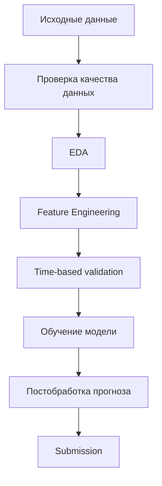

<div align="center">

# 📈 Retail Turnover Forecasting

Проект по прогнозированию месячного розничного товарооборота (РТО) магазинов сети «Пятёрочка».


</div>

## О проекте

В репозитории представлены два независимых решения задачи прогнозирования месячного **розничного товарооборота (РТО)** магазинов сети **«Пятёрочка»**, разработанные в рамках хакатона **X5 Group «Градиент роста»**.

Цель проекта — спрогнозировать РТО каждого магазина на следующий месяц на основе истории продаж, характеристик магазина, инфраструктуры и временных закономерностей.

---

## Пайплайн



---

## Структура репозитория

```text
gradient-rosta/
│
├── stage1_train/
│   ├── random_forest.ipynb
│   ├── train.csv
│   ├── README.md
│   └── images/
│       └── feature_importance.png
│
├── stage2_train2/
│   ├── solution.ipynb
│   ├── train_2.csv
│   ├── README.md
│   └── images/
│       ├── error_distribution.png
│       ├── feature_importance.png
│       ├── full_correlation_matrix.png
│       ├── prediction_vs_true.png
│       ├── seasonality_by_month.png
│       ├── target_distribution.png
│       └── yoy_growth_janfeb.png
│
├── requirements.txt
├── LICENSE
├── README.md
└── .gitignore
```

---

## Результаты

| Этап | Модель | Результат |
|------|---------|----------:|
| Этап 1 | Random Forest | **MAPE = 2.78%** |
| Этап 2 | CatBoost + Feature Engineering + Adaptive Clipping | **MAPE ≈ 7.67% (82.69 балла)** |

## Выбор моделей

В репозитории представлены два независимых решения.

- **Stage 1** — Random Forest как сильный базовый ансамблевый метод для табличных данных.
- **Stage 2** — CatBoost с расширенным feature engineering и адаптивной постобработкой прогноза, обеспечивший наилучшее качество.

---

## Стек технологий

- Python
- Pandas
- NumPy
- CatBoost
- Scikit-learn
- Matplotlib
- Seaborn
- Jupyter Notebook

---

## Воспроизводимость

Каждый этап содержит:

- Jupyter Notebook с полным пайплайном;
- README с описанием решения.

Общие зависимости проекта перечислены в корневом `requirements.txt`.

---

## Лицензия

MIT License.