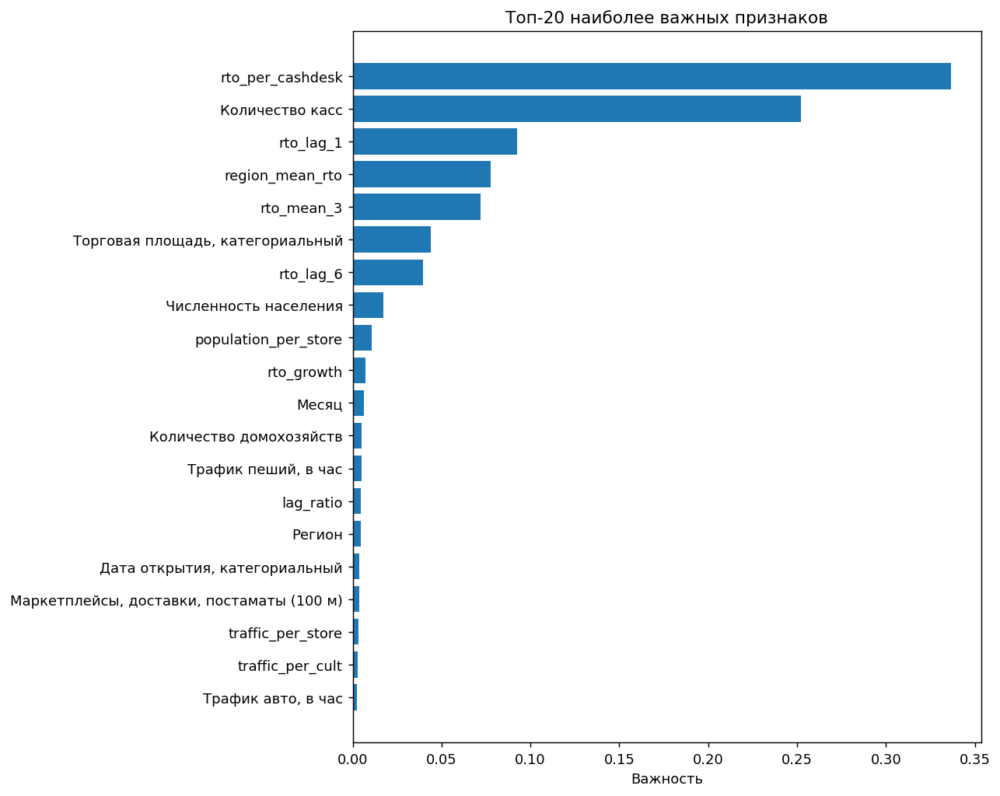

# Retail Turnover Forecasting — X5 "Градиент роста"

Проект решает задачу прогнозирования месячного РТО (розничного товарооборота) сети магазинов X5 на основе истории продаж и характеристик магазина, чека и локальной инфраструктуры.
В рамках первого этапа хакатона использовался упрощённый датасет `train.csv`, содержащий **20 615 магазинов** и **10 последовательных месяцев наблюдений** (без признака года). Итоговая модель — **Random Forest**, достигшая **MAPE = 2.78%** на time-based holdout.

## Контекст задачи

Первый этап предоставлял упрощённый датасет:

- история продаж за **10 последовательных месяцев**;
- отсутствовал признак года;
- требовалось спрогнозировать РТО последнего месяца.

## Данные

| Параметр | Значение |
|---|---:|
| Объект прогноза | месячный РТО магазина |
| Размер датасета | 206 150 строк |
| Количество магазинов | 20 615 |
| Период наблюдений | 10 месяцев |
| Исходные признаки | 19 колонок |
| Пропуски / дубликаты | 0 |
| Целевая переменная | `РТО` |

---

## Анализ данных

- РТО распределён с сильной правой асимметрией (среднее 32.7M, медиана 27.9M) — использована
  лог-трансформация таргета.
- Самый сильный сырой предиктор — `Количество касс` (корр. 0.64): чем крупнее магазин, тем выше
  оборот. Дальше по силе — население района и инфраструктура рядом (аптеки, остановки, маркетплейсы).
- Один `Месяц` почти не несёт сигнала (корр. 0.07) — без лаговых признаков по истории самого
  магазина не обойтись.

## Признаки

| Группа | Признаки |
|--------|----------|
| История продаж | лаги РТО (1, 2, 3, 6 месяцев), rolling mean/std |
| Тренды | month-over-month growth, отношение лагов |
| Магазин | количество касс, площадь, характеристики магазина |
| Инфраструктура | население, домохозяйства, аптеки, остановки, маркетплейсы |
| Производные | РТО на кассу, трафик на магазин, население на магазин |
| Региональные | среднее РТО по региону |

## Важность признаков

Наибольший вклад в качество модели внесли:

- лаги РТО;
- количество касс;
- региональное среднее РТО;
- инфраструктурные показатели;
- характеристики покупательского трафика.

<p align="center">

</p>

## Пайплайн

1. Проверка качества данных и анализ распределения таргета.
2. Создание временных и инфраструктурных признаков.
3. Time-based split: обучение на месяцах 1–9, валидация на месяце 10.
4. Обучение моделей Linear Regression и Random Forest.
5. Сравнение качества по метрике MAPE.

## Выбор модели

Обе модели обучены и провалидированы на одном и том же сплите (train: месяцы 1-9, test: месяц 10 —
честный time-based holdout, без утечки).

| Модель | MAPE (holdout) |
|---|---|
| Линейная регрессия | 14.71% |
| **Random Forest** | **2.78%** |

Линейная регрессия не может уловить нелинейные взаимодействия между инфраструктурными
признаками магазина (трафик, население, конкуренты рядом) и историей продаж —
а именно они определяют РТО. Random Forest, в отличие от неё, сам находит эти взаимодействия и
устойчив к разным масштабам и распределениям признаков без ручного feature engineering под линейную
модель (полиномиальные члены, взаимодействия и т.п.).

## Стек технологий

- Python
- Pandas
- NumPy
- Scikit-learn
- Matplotlib
- Seaborn
- Jupyter Notebook

## Как запустить

```bash
python -m venv .venv
source .venv/bin/activate      # Windows: .venv\Scripts\activate
pip install -r requirements.txt
jupyter notebook random_forest.ipynb
```

Файл `train.csv` должен находиться в той же директории, что и ноутбук.

## Навыки, применённые в проекте

- Постановка ML-задачи прогнозирования месячного РТО магазинов.
- Анализ качества данных: распределение таргета, корреляции, выбросы и информативность признаков.
- Feature engineering для табличных данных: лаговые, rolling- и производные признаки.
- Построение плотностных и региональных агрегированных признаков.
- Корректная time-based валидация для задачи прогнозирования временных рядов.
- Сравнение линейной модели и ансамблевого метода (Random Forest).
- Интерпретация модели с помощью анализа важности признаков.

## Возможные улучшения

- подбор гиперпараметров;
- сравнение с градиентным бустингом;
- расширение набора временных признаков;
- использование более длинной истории наблюдений.