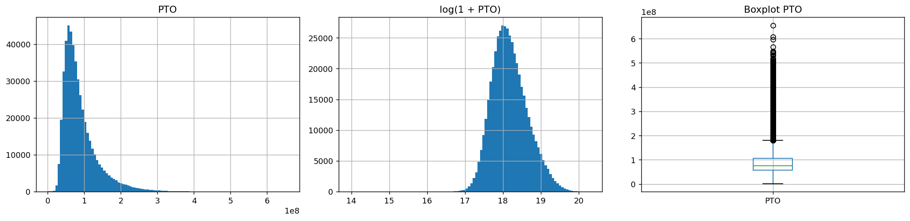
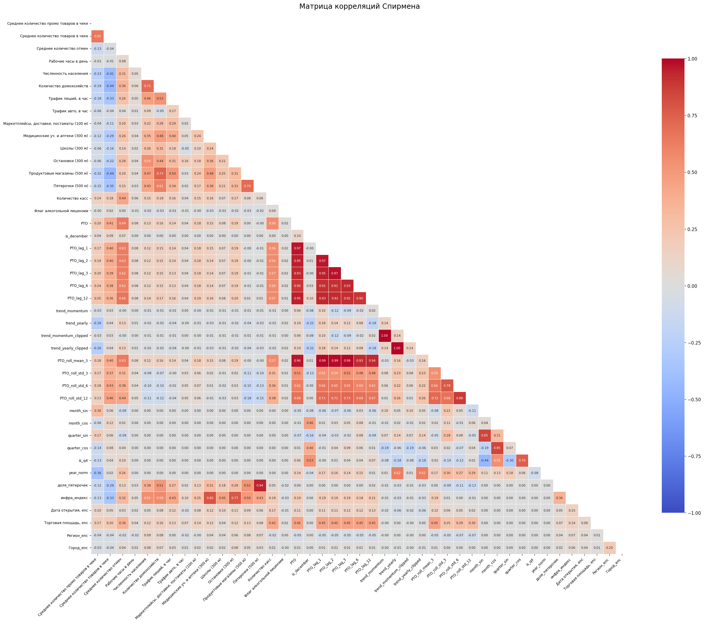
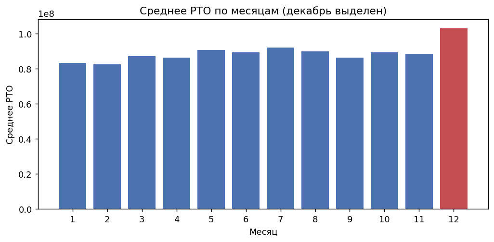
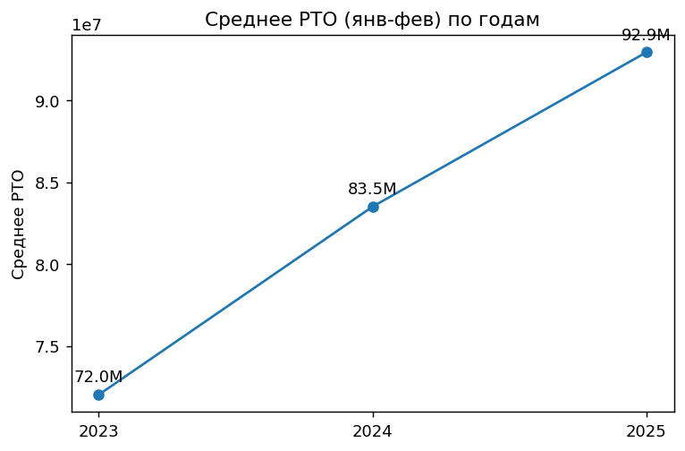
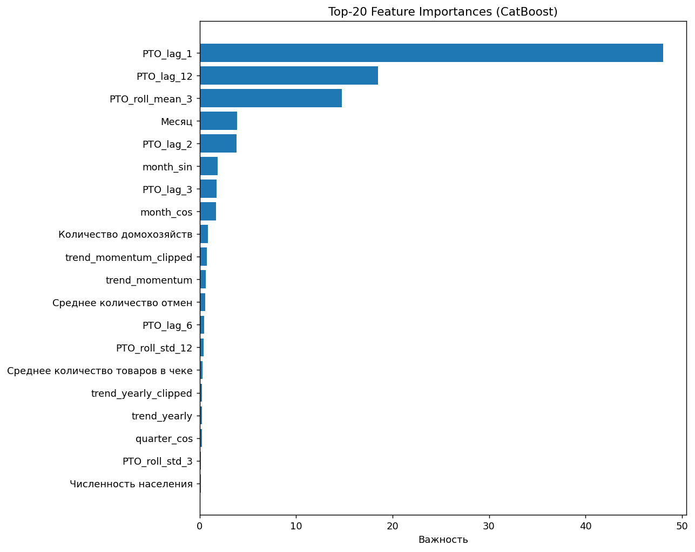
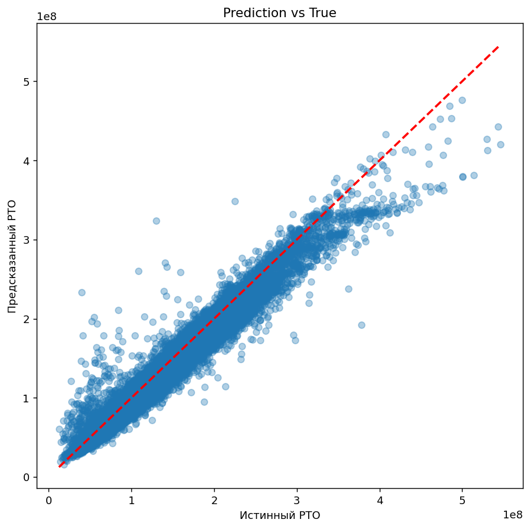
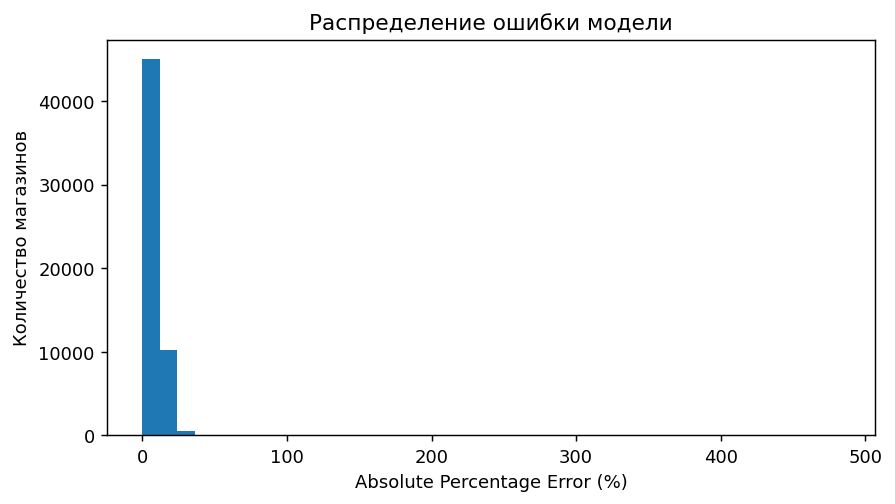

# Retail Turnover Forecasting — X5 "Градиент роста"

Проект решает задачу прогнозирования месячного РТО (розничного товарооборота) сети магазинов X5 на основе истории продаж, характеристик магазина, чека и локальной инфраструктуры.
Финальная модель — один регуляризованный **CatBoost** с адаптивной пост-обработкой прогноза (клип по волатильности магазина). На закрытом тесте — **82.69 баллов** (MAPE = 7.67%).

## Контекст задачи

Для розничной сети важно заранее оценивать оборот магазинов, чтобы планировать товарные запасы,
промо, операционные ресурсы и финансовые ожидания. Пайплайн прогнозирует РТО на месяц вперёд для
каждого магазина с учётом сезонности, динамики прошлых периодов и статических характеристик точки.

## Данные

| Параметр | Значение |
|---|---:|
| Объект прогноза | месячный РТО магазина |
| Размер датасета | 485 082 строки |
| Количество магазинов | 18 657 |
| Период наблюдений | январь 2023 – февраль 2025 (26 месяцев) |
| Исходные признаки | 24 колонки |
| Пропуски / дубликаты | 0 |
| Целевая переменная | `РТО` |

Основные группы признаков:

- история РТО: лаги 1, 2, 3, 6, 12 месяцев, rolling mean/std, momentum и годовой тренд (с клипом
  выбросов — без него встречались тренды вплоть до +3500%/+7000% на паре десятков магазинов);
- календарь: месяц, флаг декабря;
- магазин: рабочие часы, количество касс, алкогольная лицензия, площадь, дата открытия;
- чек и операции: среднее количество товаров, промо-товаров и отмен в чеке;
- география и инфраструктура: регион, город, население, домохозяйства, пеший/авто-трафик, школы,
  остановки, аптеки, конкуренты и постаматы рядом.

## Анализ данных

**Распределение РТО сильно скошено вправо** (skew = 1.99) — лог-трансформация приводит его к почти
симметричному виду (skew = 0.37):

<p align="center"></p>

**Матрица корреляций Спирмена** показывает, что наиболее сильную связь с РТО имеют лаговые признаки, отражающие историю продаж магазина. Среди признаков, не использующих прошлые значения РТО, наиболее информативными оказались:

<p align="center"></p>

- **`Среднее количество отмен` — 0.64** (сырое значение, без лага). Отмены на кассе — по сути
  прокси трафика и оборота: чем больше транзакций в принципе проходит через магазин, тем больше и
  отмен, и продаж. Даже лагированная на 1 месяц версия этого признака коррелирует с будущим РТО на
  **0.71** — почти как отдельный лаг таргета, хотя формально это операционная метрика, а не продажи.
- `Количество касс` — 0.56: крупные магазины с большим числом касс стабильно продают больше.
- `Среднее количество товаров в чеке` — 0.41: чем полнее корзина покупателя, тем выше оборот.

**Сезонность — устойчивый декабрьский пик**: среднее РТО в декабре на **17.5% выше**, чем в
среднем по остальным месяцам года. При этом **53% всех IQR-выбросов по РТО** приходятся именно на
декабрь — то есть это не шум, а предсказуемый сезонный эффект (учтён явным флагом `is_december`,
а не удалением как аномалии):

<p align="center"></p>

**Рост РТО год к году постепенно замедляется**: сравнение среднего РТО за январь-февраль по годам
показывает +15.9% в 2024 к 2023, но только **+11.3% в 2025 к 2024** — сеть продолжает расти, но
темп ниже, чем годом ранее:

<p align="center"></p>

## Признаки

| Группа | Признаки |
|---------|----------|
| Лаговые | lag_1, lag_2, lag_3, lag_6, lag_12 |
| Rolling | rolling mean/std |
| Trend | momentum, yearly trend |
| Calendar | month, is_december, cyclic encoding |
| Store | площадь, дата открытия, кассы |
| Infrastructure | население, школы, остановки, аптеки |
| Encodings | target encoding региона и города |

## Важность признаков

Наибольший вклад в прогноз внесли лаговые признаки, характеристики магазина и операционные показатели. Это подтверждает, что модель в первую очередь использует историю продаж, дополняя её информацией о размере магазина, инфраструктуре и покупательской активности.

<p align="center">
  
</p>


## Пайплайн

1. Загрузка и проверка данных: пропуски, полные дубликаты и дубликаты по ключу `new_id + Год + Месяц`.
2. Приведение периода к единому `date`, сортировка рядов по магазину, проверка полноты временных рядов.
3. Анализ распределения РТО и выбросов внутри магазинов через IQR (декабрьские выбросы не удаляются
   — см. анализ выше).
4. Лог-трансформация таргета `log1p(РТО)`.
5. Генерация временных признаков: лаги, rolling-статистики, momentum и yearly trend — с клипом
   экстремальных значений тренда (`[-0.9, 3.0]`), которые иначе дают редкие, но разрушительные для
   MAPE промахи модели.
6. Календарные и инфраструктурные признаки.
7. Кодирование категорий: target encoding для региона и города по train (без утечки). От ordinal
   label encoding отказались — для дерева это ложный порядок величин, только шумит.
8. Отбор признаков, проверка мультиколлинеарности.
9. Time-based split: train — вся история кроме последнего месяца, test — последний месяц (holdout).
10. Обучение одного `CatBoostRegressor` (`RMSE` на лог-таргете, `depth=8`, `l2_leaf_reg=5`,
    early stopping).
11. **Пост-обработка**: адаптивный клип прогноза относительно `РТО_lag_1`. Ширина коридора зависит
    от исторической волатильности магазина (`roll_std_3 / roll_mean_3`) — у стабильных магазинов
    коридор уже, у волатильных — шире. Это дало основной прирост качества на закрытом тесте.
12. Прогноз на март 2025, сохранение в CSV.

## Результаты

| Этап оценки | Модель | MAPE |
|---|---|---:|
| Holdout (последний доступный месяц) | Один CatBoost, без клипа | 9.1% |
| Holdout + адаптивный клип прогноза | Один CatBoost + клип | 7.8% |
| **Закрытый тест** | **Один CatBoost + адаптивный клип** | **~7.67% (82.69 баллов)** |

## Качество прогнозов

Диаграмма показывает хорошее совпадение прогнозов с фактическими значениями. Большинство точек расположено вдоль диагонали, что свидетельствует об отсутствии выраженного систематического смещения модели. Основные отклонения наблюдаются для магазинов с очень высоким РТО и повышенной волатильностью.

<p align="center">
  
</p>

## Распределение ошибки

Большинство магазинов прогнозируется с небольшой относительной ошибкой. Значительные ошибки встречаются редко и, как правило, связаны с магазинами с высокой исторической волатильностью или нетипичной динамикой продаж.

<p align="center">
  
</p>

## Стек технологий

- Python
- Pandas
- NumPy
- Scikit-learn
- Matplotlib
- Seaborn
- Jupyter Notebook

## Как запустить

```bash
python -m venv .venv
source .venv/bin/activate      # Windows: .venv\Scripts\activate
pip install -r requirements.txt
jupyter notebook solution.ipynb
```

Файл `train_2.csv` должен находиться в той же директории, что и ноутбук.

## Навыки, применённые в проекте

- Постановка ML-задачи прогнозирования бизнес-метрики для розницы.
- Анализ качества данных: пропуски, дубликаты, полнота временных рядов, выбросы, сезонность.
- Feature engineering для временных рядов: лаги, rolling-статистики, тренды с обработкой выбросов.
- Target encoding категорий без утечки из теста.
- Time-based split и корректная валидация прогноза на будущий период.
- Диагностика переобучения ансамблевых моделей через сравнение CV/holdout/закрытый тест.
- Пост-обработка прогноза для устойчивости метрики MAPE к редким выбросам (адаптивный клип).

## Возможные улучшения

- Hyperparameter optimization (Optuna).
- Time-series cross-validation.
- SHAP-анализ важности признаков.
- Сравнение с LightGBM и XGBoost.
- Построение ансамблей моделей.